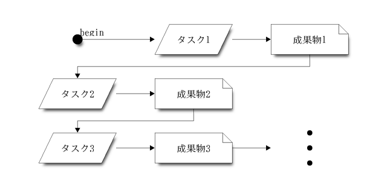
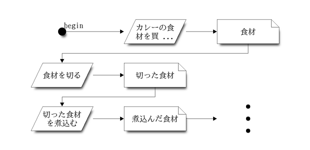
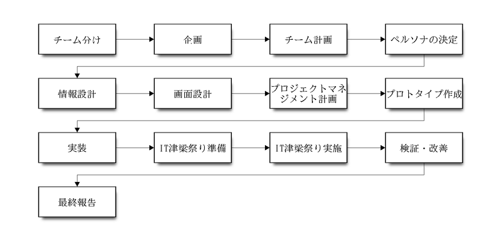
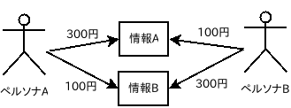
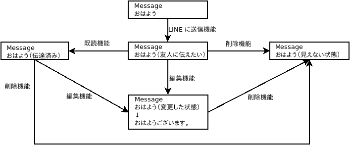
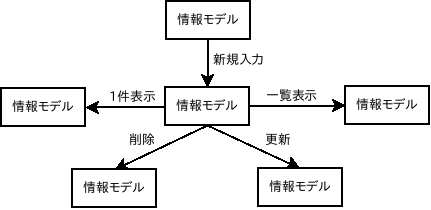
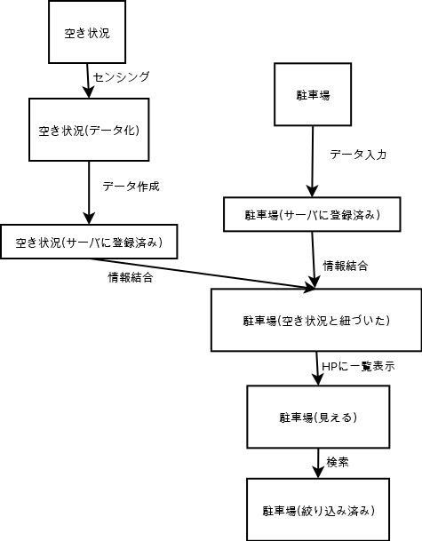

# 情報システムズ特別講義

# このページのURLは [http://bit.ly/2PreCtQ](http://bit.ly/2PreCtQ) です。

## 本講義の Slack ワークスペースは [https://meio-u-special.slack.com/](https://meio-u-special.slack.com/) です。

## 株式会社OCCの紹介

<iframe src="https://onedrive.live.com/embed?cid=269CDB82062F0E89&resid=269CDB82062F0E89%212549&authkey=ANG8p9rrrbh1-Jg&em=2" width="402" height="327" frameborder="0" scrolling="no"></iframe>

## アイスブレーク

- [メイン講師紹介](https://tomocoffee.ddns.net/profile/)
- [サブ講師紹介](https://dandydot.no-ip.biz/~dot/presen/profile/)
- [自己紹介](https://dandydot.no-ip.biz/~dot/presen/self-introduction/)
- [オープナ](https://dandydot.no-ip.biz/~dot/presen/opener/)
- [web-timer](https://web-timer-vue.herokuapp.com)

## 講義の説明

- 目的
    - 課題解決型学習を通して社会人基礎力を身につける
    - チーム開発を経験する
    - 企画を実際に形にする
    - ユーザ・お客様に製品をアピールする
- 本講義でのルール
    - 合意した内容に変更が生じる場合には事前に報告して調整する
        - 演習時間、宿題の提出日など
- やること
    - 顧客が抱える課題を解決するための開発テーマを企画する
    - 企画を元に開発テーマに沿った情報を洗い出す
    - 洗い出した情報を整理し、設計を行う
    - 設計を元にプロトタイプ(試作品)を作成する
    - 設計・プロトタイプを元に実装を行う
    - IT津梁まつりでブースを出展する
        - 人を引き付けるためのブース配置の検討をみなさんで行う
    - IT津梁まつりでライトニングトークを実施する
    - IT津梁まつりでアンケートを実施する
    - IT津梁まつりでのアンケートを集計し、開発成果の検証を行う
- やらないこと
    - オブジェクト指向分析設計
    - データベース設計
    - ユーザインタフェースデザイン
    - プロジェクトマネジメント詳細
- 心がけて欲しいこと
    - 決められた時間内に終わらせる
        - もし、時間内に終わらせる事が難しいと判断した場合には、速やかにわからない部分を聞くなどして時間内に作業を終わらせる
    - 何かを考えたり判断する場合は上記「やること」を前提にする
    - 演習における気づきを共有する
        - Slack を使って共有する
            - 講義の最後に Slack で感想や質問などを各自一言ずつ述べる
    - PDCAを小さく沢山繰り返す
        - Plan（計画）→ Do（実行）→ Check（評価）→ Action（改善）
    - インターネット上の情報を自ら活用する
        - 情報の検索
        - 方法の検索
        - よりよい方法、ツールがあれば、それを活用して良い
    - 英語の資料を読むこと
        - 高度な英語能力がなくても読むことができます
        - 騙されたと思ってやってみてください
    - タスクの関係を常に意識する
        - 前のタスクの成果物を利用しているか?
        - 飛躍がないか?
        - 漏れがないか?
        - 
        - 

## スケジュール

- [開発実習1回目](#day1)(10月31日)
    - 株式会社オーシーシーの紹介
    - 企画立案①：課題（ニーズ）に対応した企画立案＆チーム編成
    - 企画立案②： チーム毎の企画立案
    - 今後のスケジュール説明
        - ・ルール説明
- [開発実習2回目](#day2)(11月7日)
    - チーム作業の必要性
    - チーム開発の必要性と手法
    - 企画立案③： チーム毎の企画立案
    - 設計手法
        - ・情報設計
        - ・画面設計
- [開発実習3回目](#day3)(11月14日)
    - 企画立案④： プロジェクトマネジメント
    - 設計の発表＆レビュー
    - プロジェクトマネジメント
        - スケジューリング手法
            - ・WBS
            - ・かんばんによるタスク管理
- [開発実習4回目](#day4)(11月21日)
    - チーム作業
    - プロトタイプ作成
    - 実装
- [開発実習5回目](#day5)(12月5日)
    - チームレビュー
    - 実装作業
- [開発実習6回目](#day6)(12月12日)
    - チームレビュー
    - 実装作業
- [開発実習7回目](#day7)(12月19日)
    - プレゼン手法
    - 人を引き付けるためのブース配置の検討
    - アンケート作成
- [開発実習8回目](#day8)(1月9日)
    - IT津梁まつりリハーサル
- [開発実習9回目](#day9)(1月16日)
    - (予備日)
    - 最終確認
- [IT津梁まつり](#IT)(1月17日(金),18日(土))
    - IT津梁まつりブース出展
    - ライトニングトークプレゼン
    - ブース出展
    - アンケート実施
- [開発実習10回目](#day10)(1月23日)
    - 検証で見えたもの／検証結果を踏まえた改善作業
    - アンケート集計
    - 考察
    - 改善案策定
- [開発実習11回目](#day11)(1月30日)
    - 最終報告
    - 成果報告
    - 講師より総評

<a name="day1">

## 開発実習1回目 - チーム毎の企画立案
</a>

- チーム開発について
    - なぜチームなのか?
        - 規模が大きな作業への対応
        - 個人能力の相互補完によるチーム能力の拡大
        - 相互学習による個人能力の拡大
        - 相互補完による作業継続性の向上
        - 一人よりチームの方が楽しい!
    - 個人の視点からチームの視点へ
        - それは個人の思いか、チームの思いか?
        - チームにとっての最善は何か?
        - 何を持ってチームの合意とするか?
    - 役割分担
        - 重複なく・漏れなく役割を決める([MECE](https://ja.wikipedia.org/wiki/MECE))
        - 役割についてチームの合意を得る
    - コミュニケーション計画
        - 会議体
            - 情報の共有
            - 会議の時間
            - 会議の参加者
            - [5W1H](https://ja.wikipedia.org/wiki/5W1H)
        - レビュー
        - 振り返り
            - [KPT](http://kuranuki.sonicgarden.jp/2013/05/kpt.html)手法の活用
- 開発環境
    - モックアップツール
        - [Atomic](https://atomic.io/)
        - [Fluid](https://www.fluidui.com/)
    - 実行環境
        - [Netlify](https://www.netlify.com/)
        - [Google Cloud Platform](https://console.cloud.google.com/?hl=ja)
    - 開発ツール
        - [Monaca](https://ja.monaca.io/)
        - [Unity](https://unity.com/ja)
- コミュニケーションツール
    - [Slack](https://slack.com)
- 流れ
    - 

- (演習)
    - チーム分けを実施する
        - チーム名を決める
    - チームの合意形成ルールを決定する
    - チームのコミュニケーション計画を作成する
    - 役割分担を決定する
        - (例) プロジェクトマネージャ、リーダ、サブリーダ、デザイン担当、開発担当、広報、営業
        - (注意) 作業量に偏りがないように分担すること
    - (成果物)
        - 「チーム計画書」

<a name="day2">

## 開発実習2回目 - チーム毎の企画立案
</a>

- [ブレインストーミング](../discussion/#Brainstorming)

- 情報設計の流れ
    1. 取り組む課題を決定する
    1. 開発テーマを決定する
        - 2016年の開発テーマ
            - ブロック崩しゲーム
            - 連打ゲーム
        - 2017年の開発テーマ
            - ブロック崩しゲーム
            - クイズゲーム
            - VR、ホログラム
        - 2018年の開発テーマ
            - 最新技術を用いたEntertainment
                - 道の駅に訪れる子供たちに向けたエンターテイメント。ARを利用したスタンプラリー。
                - [ソースコード](https://drive.google.com/file/d/1I3WhRbveVagUacXxukvsmIYhNHMYKs9_/view?usp=sharing)
            - Community siteの作成
                - 観光客の為のコミュニケーションサイト。
                - [ソースコード](https://drive.google.com/file/d/1FNbWV_BDzpRp2BAFhRizbIne7QUG8dDD/view?usp=sharing)
    1. ペルソナを定義する
        - 誰に対して価値を提供するのかを想定し、描き出した象徴的な人物像のことを「[ペルソナ](https://ja.wikipedia.org/wiki/%E3%83%9A%E3%83%AB%E3%82%BD%E3%83%8A)」という
        - 
        - ペルソナの属性例(必要であれば1人ではなく、家族やサークルなど複数人定義する)
            - 名前
            - 年齢
            - 性別
            - 身長、体重
            - 居住地
            - 仕事
            - 生活パターン
                - 起床、通学時間、帰宅時間、就寝時間、移動方法など
            - 価値観
            - 課題
            - 家族構成
            - 恋人
            - 人間関係
            - 収入
            - 趣味や興味の対象
            - インターネットの使用状況
            - 今回開発するシステムやアプリケーションをペルソナはいつ、なぜ利用するのか?
    1. カスタマージャーニーマップを作成する
        - イラストなどを時系列に書いて顧客の心を見つめる
            - 現在の状況
            - 顧客が満足するまでの経緯
        - [カスタマージャーニーマップ](https://webtan.impress.co.jp/e/2014/03/24/16722)
    1. 開発テーマで登場する情報を全て洗い出して列挙する
    1. 洗い出した情報を整理・分類する

- (演習)
    - 取り組む課題を決定する
    - 開発テーマを決定する
    - ペルソナを定義する
    - カスタマージャーニーマップを作成する
        - 現在の状況
        - 顧客が満足するまでの経緯
    - (成果物)
    	- 「取り組む課題」
    	- 「開発テーマ」
        - 「ペルソナのプロフィール」
        - 「カスタマージャーニーマップ」
            - 現在の状況
            - 顧客が満足するまでの経緯
    - (サンプル)
        - 「ペルソナのプロフィール」
            - [Twitter利用者のペルソナプロフィール](persona/Twitter_Persona.html)
            - [沖縄に来る観光客のペルソナプロフィール](persona/Tourist.pdf)
            - [和泉守兼定のペルソナプロフィール](persona/Izumi.html)
        - 「カスタマージャーニーマップ」
	        - [カスタマージャーニーマップとは？作成する目的と作り方を解説します【無料テンプレートつき】](https://majisaka.site/custmer-journey-map/)
            - [マップを活用した事例](https://markezine.jp/article/detail/29298)

- (演習)
    - 開発テーマで登場する情報を全て洗い出して列挙する
        - 「ペルソナのプロフィール」と「カスタマージャーニーマップ」を考慮しながらブレインストーミングを行う
        - 挙がった情報を列挙する
    - 洗い出した情報を整理・分類する
        - 整理
            - 必要な情報を残し、不要な情報を捨てる
        - 分類
            - 情報をカテゴリ分けする
    - (成果物)
        - 「情報定義書」
    - (サンプル)
        - [沖縄観光における情報定義書](information/Tour.pdf)
                                 
- 画面設計
    - 必要な画面を洗い出す方法
        1. カテゴリ分けした情報がどのように状態遷移するか決定する
        1. 情報を状態遷移させるのが「機能」であり「画面」になる
            - 機能とはITを使ってペルソナの要望を満たす手段
            - 情報モデルの状態遷移(LINEの例)
            - 
            - 情報モデルの状態遷移(プロバイダ申し込み情報の例)
            - 
            - 情報モデルの状態遷移(CRUD: Create Read Update Delete)
            - 
            - 情報モデルの状態遷移(駐車場と空き状況情報の例)
            - 
                         
- (演習)
    - 必要な画面を洗い出す
        - カテゴリ分けした情報の状態遷移図を作成する
        - 状態遷移図から必要な画面の一覧を作成する
        - (成果物)
            - 「情報の状態遷移図」
            - 「画面一覧」
        - (サンプル(誤って情報モデルと機能がごっちゃになってしまった例))
            - [観光客向け予約システムにおける情報の状態遷移図](view/情報モデルの状態遷移図.jpg)
        - (サンプル(誤って画面遷移図を設計してしまった例))
            - [Twitterにおける情報の状態遷移図](view/State_Transition.jpg)

<a name="day3">

## 開発実習3回目 - プロジェクトマネジメント
</a>

- プロジェクトマネジメント
    - スケジューリング手法
        1. 必要なタスクを洗い出す
            - (例) [IT津梁祭りブース出展](images/IT津梁祭りブース出展.png)
        1. [WBS](../WBS-20160415/)
            - WBSツール
                - [MSProject](https://www.microsoft.com/ja-jp/project)
                - [ProjectLibre](https://ja.osdn.net/projects/sfnet_projectlibre/)
        1. かんばんによるタスク管理
            - 「かんばん」と呼ばれる方法でタスクを見える化する
            - 方法
                - WBSで洗い出した各タスクを付箋紙で書き出す
                - 模造紙に「Todo」「Doing」「Done」と三等分する線を引く
                - 付箋紙のタスクを全て「Todo」に張る
                - タスクに着手したら付箋紙を「Doing」に移動する
                - タスクが完了したら付箋紙を「Done」に移動する
            - (サンプル)
                - [Wikipedia:かんばん](https://ja.wikipedia.org/wiki/%E3%81%8B%E3%82%93%E3%81%B0%E3%82%93_\(%E3%82%BD%E3%83%95%E3%83%88%E3%82%A6%E3%82%A7%E3%82%A2%E9%96%8B%E7%99%BA\))
        1. カレーライスのタスク＆WBS、かんばんの例

        <iframe src="https://onedrive.live.com/embed?cid=269CDB82062F0E89&resid=269CDB82062F0E89%212547&authkey=AGAJ2I4nEDaxbow&em=2" width="402" height="327" frameborder="0" scrolling="no"></iframe>

- (演習)
    - 疑似プロジェクトの「かんばん」を作成し、タスクとタスクの関係を明らかにする
    - 以下いずれかのテーマを選択し、全てのタスクを洗い出して「かんばん」を作成する
        - 「展示会へのブース出展プロジェクト」
        - 「宴会プロジェクト」
        - 「海外旅行プロジェクト」
    - タスクで決めること
        - 担当者
        - 所要時間
        - 成果物
        - タスクの終了条件
        - (オプション)いつ開始して、いつ終了するか
        - (オプション)後続タスク

- (演習)
    - みなさんが開発する製品について、全てのタスクを洗い出し「かんばん」を作成する
    - 注意点
        - 本講義資料の冒頭にある「やること」を参照し、全てのタスクを洗い出すこと

<a name="day4">

## 開発実習4回目 - チーム作業
</a>

- プロトタイプ作成
    - モックアップツール
        - [Atomic](https://atomic.io/)
        - [Fluid](https://www.fluidui.com/)
        - [NinjaMock](https://ninjamock.com/)
        - 紙(紙芝居)
- 環境
    - 実行環境
        - [Netlify](https://www.netlify.com/)
        - [Google Cloud Platform](https://console.cloud.google.com/?hl=ja)
- 実装
    - 開発ツール
        - [Bubble](https://bubble.io/)
            - [ノーコードでウェブアプリが作れる！Bubble（バブル）の使い方](https://blog.nocodelab.jp/entry/2019/07/24/%E3%83%8E%E3%83%BC%E3%82%B3%E3%83%BC%E3%83%89%E3%81%A7%E3%82%A6%E3%82%A7%E3%83%96%E3%82%A2%E3%83%97%E3%83%AA%E3%81%8C%E4%BD%9C%E3%82%8C%E3%82%8B%EF%BC%81Bubble%EF%BC%88%E3%83%90%E3%83%96%E3%83%AB)
        - [Monaca](https://ja.monaca.io/)
            - [Monaca Docs - サンプル&Tips](https://docs.monaca.io/ja/sampleapp/)
        - [Unity](https://unity.com/ja)
    - 参考
        - [JavaScript DOM の説明](../JavaScript-DOM)
        - [Monacaサンプルアプリの改変例](../monaca)
        - [jQuery](http://jquery.com/)
            - [jQueryでクリックやエンター入力のイベントを処理する例](jquery)

- (演習)
    - プロトタイプ作成
        - 「画面一覧」を元に「画面遷移図」を作成する
        - モックアップツールを利用し「画面遷移図」通りに遷移するプロトタイプを作成する
        - (参考)
            - [Fluid手順書](../fluidui/_build/html/index.html)
    - 実装
        - 開発ツールを利用し製品を作成する

<a name="day5">

## 開発実習5回目 - チーム作業
</a>

- チームレビュー
- 実装

<a name="day6">

## 開発実習6回目 - チーム作業
</a>

- チームレビュー
- 実装

<a name="day7">

## 開発実習7回目 - 製品検証目的のイベント出店に向けたプレゼン準備
</a>

- プレゼン手法
    - 手順
        1. 伝えたいことを1～3つ決める
        1. 伝えたいことを簡潔な文章(キャッチフレーズ)で書きだす
        1. 伝えるためのストーリー(プロット)を決める
        1. プレゼン資料の全体構成(アウトライン)を作成する
        1. 全体構成(アウトライン)に沿ってプレゼン資料の各ページを作成する
    - テクニック
        - ホールパート法
            - 何かを分かり易く説明するための手法
                1. まず全体像を説明する
                1. 次に、詳細を説明する
                1. 最後にまとめとして全体像をふりかえる
            - 全体-部分-全体(ホール・パート・ホール)の良い所
                - 聴者が先を予想しながら聞ける
                - 最低3回、同じことを説明できる
        - 例え話
            - 聴者にイメージを描いてもらい、効果的に話を聞いてもらうために利用します
            - 一般的な知識をベースにしたものを利用するのがコツです
            - (例)
                - 独自のデータフォーマットは例えるなら外国語のようなものです。他国(他のシステム)からは理解できません
                - Javaのクラスとは「たこ焼プレート」のようなものです。プレートを元に作られるのが「たこ焼」ですが、これがJavaではインスタンスです
        - 発問
            - 聴者自ら考えて欲しいときに、聴者に対して問題を投げかけるのが発問です
            - どんなときに発問するのか?
                - 聴者に考えてもらう
                - 聴者に参加を促す
                - 聴者の講師への依存度を下げる
                - 話し合いをはじめるきっかけを作る
                - 理解度を確かめる
            - (例)
                - みなさんゲームに対して不満はございませんか?
                - このシステムを導入することのメリットについてどう思いますか?
                - …について話して頂けませんか?
            - 注意点
                - 発問により、プレゼンが効果的になるようにする
                - 想定される回答を事前に用意し、回答に対するリアクションまで考えておく
        - 質問への対応方法
            - 質問は最後まで聞くこと
            - 発表者は質問を復唱し聴者全体が「今どういう質問が出ているのか」を理解してもらい、その後に回答する
                - (例) 今のご質問は〇〇〇ということでよろしかったですね?
        - スライド作成テクニック
            - [高橋メソッド](https://ja.wikipedia.org/wiki/%E9%AB%98%E6%A9%8B%E3%83%A1%E3%82%BD%E3%83%83%E3%83%89)
                - 短い単語や文章を大きな文字で表示する
            - [もんたメソッド](http://d.hatena.ne.jp/keyword/%A4%E2%A4%F3%A4%BF%A5%E1%A5%BD%A5%C3%A5%C9)
                - 肝心な部分を隠し、説明直前に表示する
                - (例) 「今〇〇〇が熱い!」→「今JavaScriptが熱い!」
        - 良質なスライドを参考にする
            - スライド共有サイト
                - [SlideShare](http://www.slideshare.net/)
                - [Speaker Deck](https://speakerdeck.com/)
        - プレゼン練習
            - 事前に制限時間内で伝えたいことが伝えられるよう練習する
            - 質疑応答の時間がある場合、想定される質問を事前に列挙し、その回答や回答スライドを用意しておく
            - 短い文章で言いきれているかチェックする
            - 使用するジェスチャーが効果的かチェックする
            - 板書をする場合、事前に板書する内容を書いておく(描いておく)
- 人を引き付けるためのブース配置の検討
    - まずは制約事項を把握する
        - 出店マニュアルや質問を通して [IT津梁まつり](http://www.it-matsuri.net/) の制約を把握する
        - ブースの広さ
        - レンタル可能な機材
        - パネルの設置可否
        - パネルの印刷方法
        - ライトニングトークの発表資料の送付方法
        - 禁止事項
    - 大前提
        - 以前に想定した「ペルソナ」が立ち寄りたくなるブースを考える
    - 動線
        - 左回りの法則
            - 人は無意識に左回りを好み、道に迷うと左を選ぶ
            - コンビニが典型
        - 立ち寄りたいブース
            - 恐くない雰囲気
                - 専門知識がなくても話ができそうな雰囲気
                - (もしかすると、ただチラッと見たいだけの来場者もいるかもしれない)
            - 何か貰えそう
                - 最新情報
                - アイデア
                - ノベルティ
    - チェックポイント
        - 遠くからでも目立つか?
        - (ポスターなど)遠くからでも読めるか?
        - 呼び込みはどのように行うか?
            - 衣装は?
            - キャッチフレーズは?
            - どう説明・説得するか?
        - 何か配布するか?
            - チラシ
            - ノベルティ
- アンケート作成
    - チェックポイント
        - 来場者から何を聞き取りたいか?
        - 改善につながるアンケート結果が得られるものになっているか?
        - 何件のアンケート回答を得たいのか?
    - 注意点
        - アンケート内容が誘導質問になると、実際の意見が聞けなくなってしまう
        - 1(大変良くない) 2(良くない) 3(どちらとも言えない) 4(良い) 5(大変良い)
            - この場合　3(どちらとも言えない)　を選びがちになる
        - 1(大変良くない) 2(良くない) 3(良い) 4(大変良い)
            - この場合、実際の意見が得られやすい
        - アンケートに答えるメリットがなければ、なかなか答えてくれない
            - (対策例) アンケート用紙をくじ引きの抽選券にする
            - (対策例) アンケートの意図を伝え、賛同してもらう

<a name="day8">

## 開発実習8回目 - IT津梁まつりリハーサル
</a>

- IT津梁まつりリハーサル
  - 製品の動作確認
  - プレゼン資料(プレゼンスライド、パネル、チラシ等)の最終確認
  - ブース配置、ブース装飾、当日役割の最終確認
    - どういう呼び込みをするか?
    - ノベルティを配るか?
    - ブースをどのように彩るか?
    - どういう衣装でブースに立つか?
  - アンケート内容・方法の最終確認

<a name="day9">

## 開発実習9回目 - 最終確認
</a>

- (予備日)
- 全体最終確認

<a name="IT">

## IT津梁まつりブース出展
</a>

- ライトニングトークプレゼン
- ブース出展
- アンケート実施

<a name="day10">

## 開発実習10回目 - 検証で見えたもの／検証結果を踏まえた改善作業
</a>

- アンケート集計
  - アンケート結果を集計する
  - グラフや図を用いて、アンケート結果を見える化し、傾向やパターンを探る
      - (参考) [Excel・エクセル｜グラフの作り方・編集テクニック - Be Cool Users Office](http://www.becoolusers.com/excel/excel-graph.html)
      - (参考) [QC7つ道具](http://fk-plaza.jp/Solution/solu_qc7.htm)
  - 目標値が達成されたかを判断する
- 考察
  - アンケート結果から分かったことをまとめる
- 改善案策定
  - 今回の課題を洗い出し、改善策を検討してまとめる
- IT津梁まつりの感想
- ライトニングトークをもう一度

<a name="day11">

## 開発実習11回目 - 最終報告
</a>

- 成果報告
- 講師より総評
